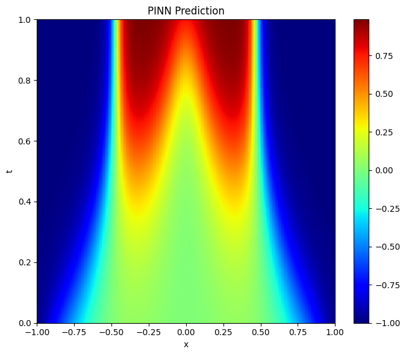
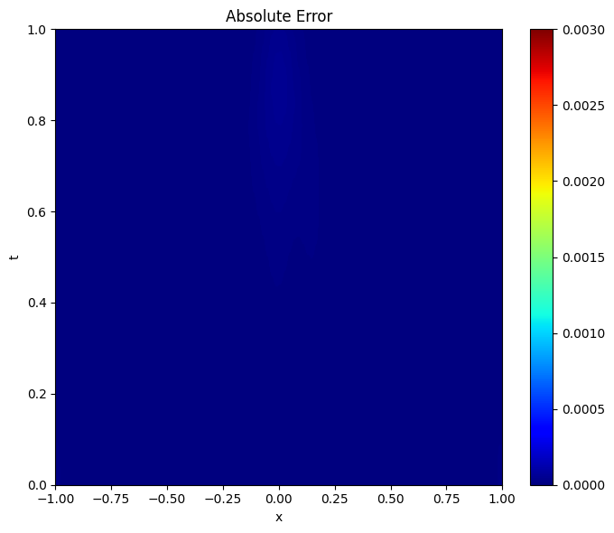
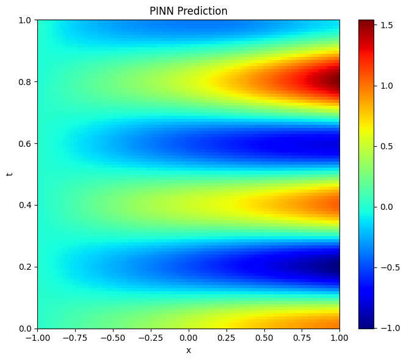
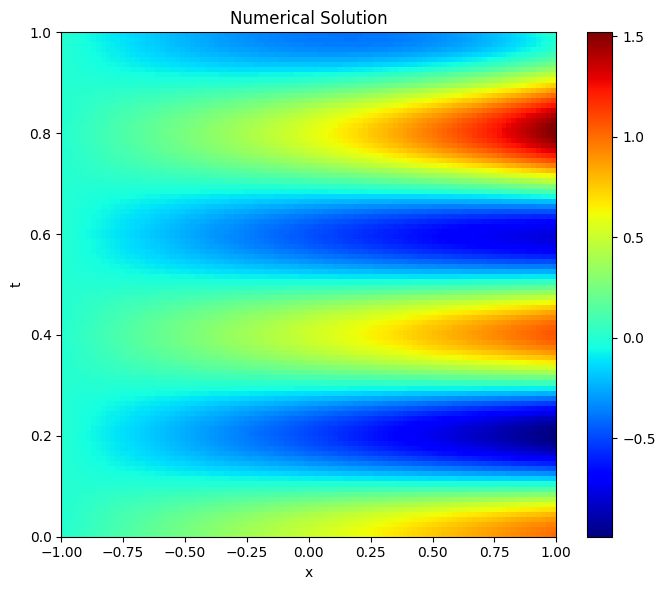
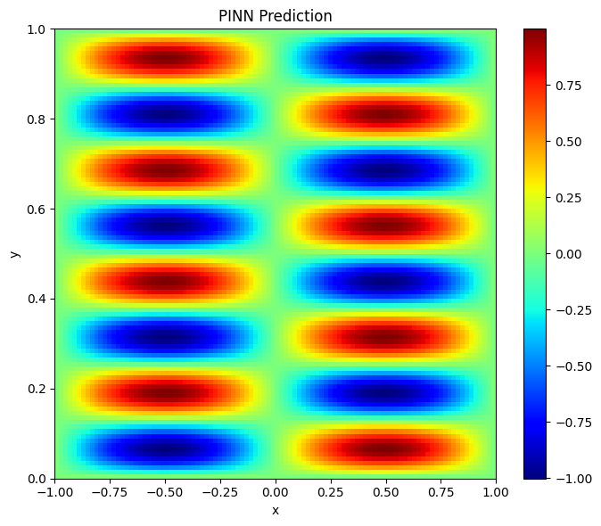
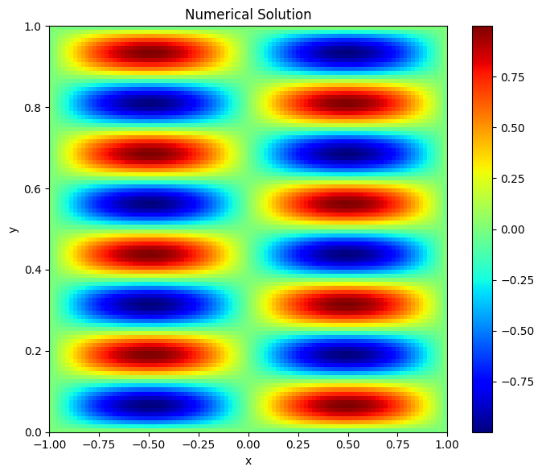
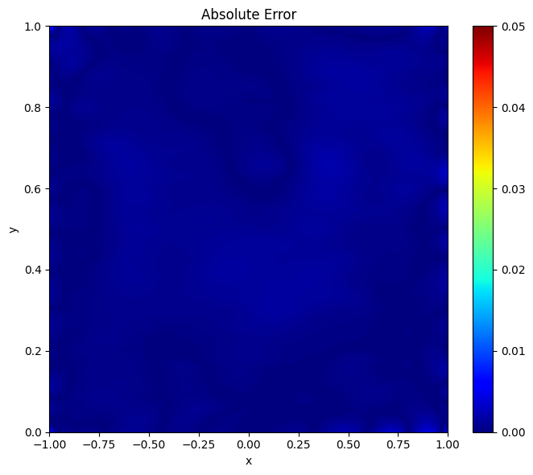
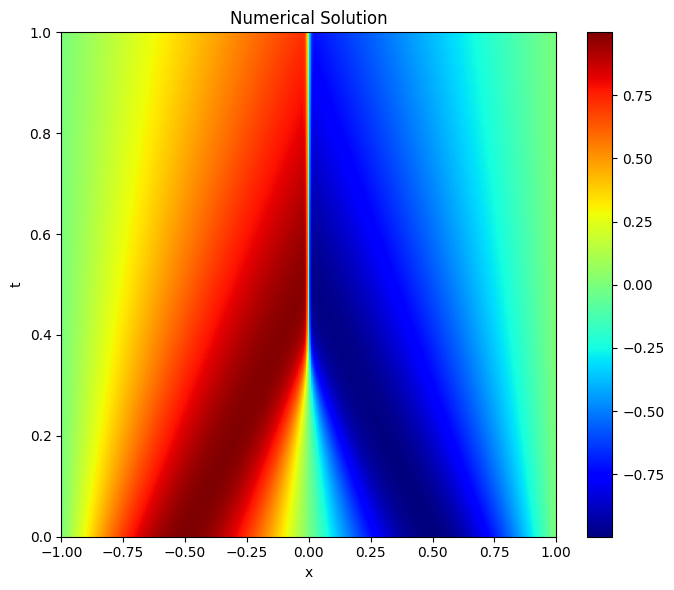
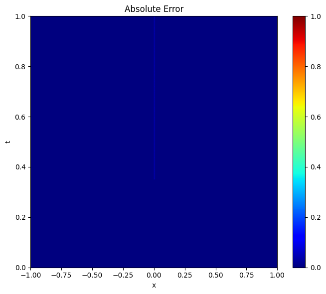

# Enhancing Physics-Informed Neural Networks for Solving Stiff ODEs and PDEs

This repository contains the implementation and results corresponding to the Dual Degree Project titled "Enhancing Physics-Informed Neural Networks for Solving Stiff ODEs and PDEs".

## Overview

Physics-Informed Neural Networks (PINNs) are a powerful class of deep learning models that integrate governing physical laws directly into the learning process by incorporating differential equation residuals into the loss function. Despite their success in various scientific applications, standard PINNs exhibit poor performance when solving stiff differential equations—those characterized by wide disparities in time or spatial scales.

This work proposes and evaluates novel strategies to improve the accuracy, convergence, and stability of PINNs on stiff PDEs and ODEs, culminating in a new framework called ATHENA-PINN.

**ATHENA-PINN**: Combines the following:
  - Adaptive sampling based on Hessian, Gradients, and Residuals
  - Time marching through sequential intervals
  - Triangular cyclic sampling schedule for smooth training
  - Second-order optimizers (LBFGS and Newton-CG ([Source](https://github.com/pratikrathore8/opt_for_pinns/blob/main/src/opts/nys_newton_cg.py) for Newton-CG code alone))
  - Gradient-weighted loss scaling

## Results

Plots of the heatmaps of PINN Prediction, True Numerical Solution, and Error

| Model        | PINN Prediction | True Numerical Solution | Error |
| ------------ | --------------- | ------------------------ | ----- |
| Allen-Cahn   |  |  |  |
| Klein-Gordon |  |  |  |
| Helmholtz    |  |  |  |
| Burgers      |  |  |  |

Here are the L2 Test loss values:

| Model       | Allen-Cahn  | Helmholtz    | Klein-Gordon | Burgers |
| ------------ | ---------------------- | ------------ | ------------ | ------- |
| Baseline PINN | 3.10e-1              | 4.67e-1     | 9.98e-1     | 7.34e-1      |
| ATHENA-PINN  | **4.03e-4**           | **1.83e-3** | **1.91e-3** | **3.83e-3**  |

## How to run

### Repository Structure

```
├── optimizers/             -> Implementations of 2nd order optimizer  
├── plots/                  -> Output heatmaps and figures  
├── src/                    -> PINN models    
├── .gitignore           
├── requirements.txt    
└── README.md 
```

### Running on local device

Setup the environment
```bash
git clone https://github.com/ArunPalaniappan/DDP-ME20B036-ATHENA-PINN.git
cd DDP-ME20B036-ATHENA-PINN
pip install -r requirements.txt
 ```

Run the model
```bash
python src/ATHENA-PINN-Allen-Cahn.py
 ```
## Acknowledgements

This work was carried out under the guidance of Prof. Balaji Srinivasan, Department of Data Science and Artificial Intelligence, Indian Institute of Technology Madras.
